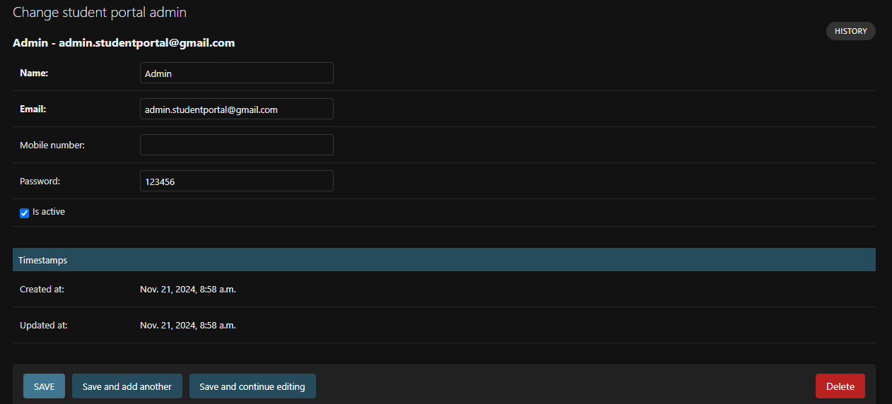
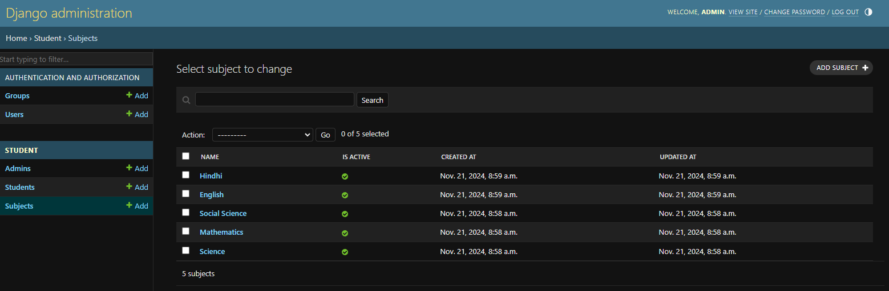

# student-portal

## Description
It is a student portal which as login module, create, edit, delete, listing and logout functionalities
I have used the token based authorization

## Prerequisites

Before you begin, ensure you have the following installed:

- **Python 3.x**: [Download Python](https://www.python.org/downloads/)
- **pip**: Ensure pip is installed by running `python -m ensurepip`.

## Installation

### 1. Clone the Repository

First, clone the repository to your local machine:

```bash
git clone https://github.com/LikhithKumars8/student-portal.git
cd student-portal
```

## Create virtual environment
python -m venv venv

## Activate virtual environment
## On Windows
venv\Scripts\activate

## On macOS/Linux
source venv/bin/activate

## Install the necessary dependencies using pip:
pip install -r requirements.txt

## Create the database file in the main folder. This will act as the storage for your data.touch 
touch db.sqlite3

## Apply database migrations
### Run the following commands to set up your database schema:

### Create migrations based on model changes
python manage.py makemigrations

### Apply the migrations to the database
python manage.py migrate

## To run the app locally, start the development server with:
python manage.py runserver

## Once the server is running, open your web browser and go to:
http://127.0.0.1:8000

to access django admin do visit /admin
to access login screen do visit student/login/

## For now create the Admin and subjects using django-admin




## After setting up the project run this command
python manage.py collectstatic
